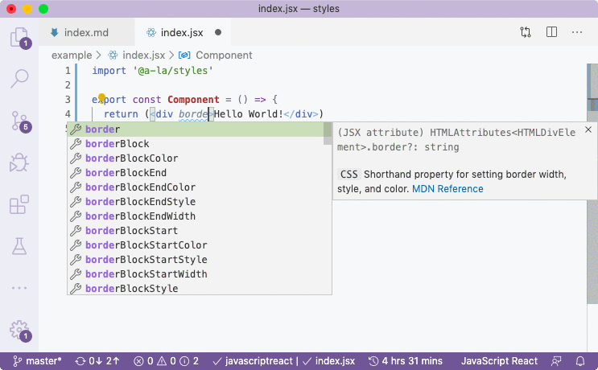

# @a-la/styles

[](https://www.npmjs.com/package/@a-la/styles)

`@a-la/styles` is CSS Properties For JSX.

<p align="center">
  
</p>

```sh
yarn add -D @a-la/styles
npm i --save-dev @a-la/styles
```

## Table Of Contents

- [Table Of Contents](#table-of-contents)
- [Usage](#usage)
- [Special Cases](#special-cases)
- [Copyright & License](#copyright--license)

<p align="center"><a href="#table-of-contents">
  
</a></p>

## Usage

By installing this package, you will be able to specify styles on tags and components as JSX properties when using [`alamode`](https://github.com/a-la/alamode) transpiler.

To receive access to auto-completions, you'll need to import the `@a-la/styles` package in your source code:

```jsx
import '@a-la/styles'
// or if using Preact 8:
import '@a-la/styles/preact'

export const Component = () => {
  return (<div border="1px solid green">Hello World!</div>)
}
```

The actual import doesn't do anything as the source file is blank. It is needed only for VSCode to pick up distributed typings.

Because of [a bug](https://github.com/microsoft/TypeScript/issues/28905) in VSCode, you won't see properties with hyphens, e.g., `margin-top` and will only see `marginTop`, but you can actually use both. The camel cases are added for discoverability of properties.

<p align="center"><a href="#table-of-contents">
  
</a></p>

## Special Cases

Some CSS properties will interfere with attributes of certain tags. There's an ignore map at [`/ignore.json`](/ignore.json) that prevents the output of the following cases:

```html
<hr	width color size>
<pre	width>

<iframe	width height>
<embed	width height>
<object	width height border>
<video	width height>
<input	width height size alt>
<canvas	width height>
<table	border>
<body	background>
<meta	content>
<br	clear>
<select	size>
<area	alt>
```

<p align="center"><a href="#table-of-contents">
  
</a></p>

## Copyright & License

GNU Affero General Public License v3.0

Data comes from [VS Code Web Custom Data](https://www.npmjs.com/package/vscode-web-custom-data):

- `css/mdn/mdn-documentation.js` is built upon content from [Mozilla Developer Network](https://developer.mozilla.org/en-US/docs/Web) and distributed under CC BY-SA 2.5.

<table>
  <tr>
    <th>
      <a href="https://www.artd.eco">
        
      </a>
    </th>
    <th>© <a href="https://www.artd.eco">Art Deco™</a> for <a href="https://alamode.cc">À La Mode</a> 2020</th>
  </tr>
</table>

<p align="center"><a href="#table-of-contents">
  
</a></p>